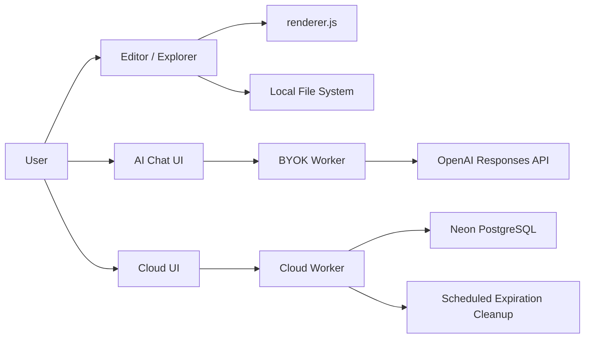

# Data Flow｜資料流

```mermaid
flowchart LR
  U[User] --> E[Editor / Explorer]
  E --> R[renderer.js]
  E --> L[Local File System]
  U --> A[AI Chat UI]
  A --> B[BYOK Worker]
  B --> O[OpenAI Responses API]
  U --> C[Cloud UI]
  C --> W[Cloud Worker]
  W --> N[Neon PostgreSQL]
  W --> T[Scheduled Expiration Cleanup]
```

**信任邊界**：瀏覽器不應包含 `DATABASE_URL`；BYOK Key 只應經 TLS 傳輸，不應持久化到日誌。雲端 File Hash ID 是 capability，持有者可能具備讀寫刪除能力，並非登入認證。
